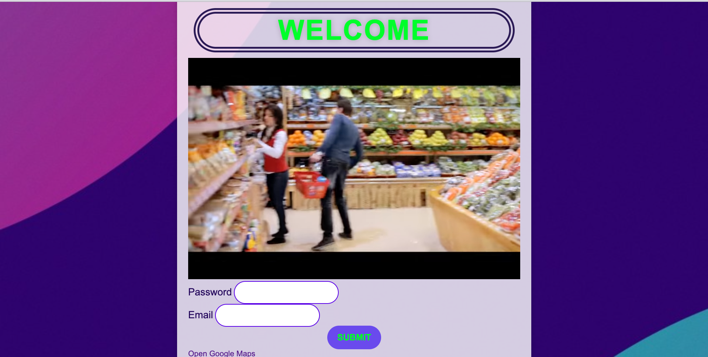

# SuperMarket Flask
# Project Overview
SuperMarket Flask is a web application for online shopping. It allows users to browse a list of products, add them to a shopping cart, and proceed to checkout and payment. The application is built using the Flask web framework and includes functionality to manage shopping carts, calculate total prices, and handle item removal.

Table of Contents
Getting Started
Prerequisites
Installation
Project Structure
Usage
Running the Application
Navigating the Pages
Features
Contributing
License
Getting Started
Prerequisites
Before running the project, make sure you have the following prerequisites installed:

# Python (3.x recommended)
# Flask (a Python web framework)
# Installation
# Clone this repository to your local machine:

bash
# Copy code
git clone https://github.com/01001110IR/SuperMarket_Flask.git
Change to the project directory:

bash
# Copy code
cd SuperMarket_Flask
Create a virtual environment (recommended) and activate it:

bash
# Copy code
python -m venv venv
source venv/bin/activate  # On Windows, use `venv\Scripts\activate`
Install the project dependencies:

bash
# Copy code
pip install -r requirements.txt
Project Structure
The project has the following structure:

# Project Structure
arduino
Copy code
SuperMarket_Flask/
│
├── templates/
│   ├── index.html
│   ├── checkout.html
│   └── pic.html
│
├── static/
│   ├── css/
│   │   └── styles.css
│   │
│   ├── js/
│   │   └── script.js
│   │
│   └── json/
│       └── data.json
│
├── app.py
└── README.md

Usage
Running the Application
To run the application, follow these steps:

# Ensure you have activated your virtual environment (if used).

# Run the Flask application:

bash
# Copy code
python app.py
The application should now be running locally. Open a web browser and navigate to http://localhost:8000 to access the main page.

Navigating the Pages
Main Page (index.html): This is the main page where users can browse products, add them to the shopping cart, and view the contents of the cart. Items can be added or removed from the cart on this page.

Checkout Page (checkout.html): TODO: Describe the checkout and payment page here.

Additional Page (pic.html): This is an additional page included in the project for demonstration purposes.

Features
Adding products to the shopping cart.
Updating the shopping cart in real-time.
Calculating the total price of items in the cart.
Removing items from the cart.
TODO: Describe additional features here.
Contributing
If you'd like to contribute to this project, please follow these guidelines:

Fork the repository on GitHub.

# Create a new branch with a descriptive name for your feature or bug fix:

bash
# Copy code
git checkout -b feature-name
Make your changes and commit them with clear and concise commit messages.

Push your branch to your fork:

bash
# Copy code
git push origin feature-name
Create a pull request on GitHub, describing your changes and why they should be merged.

Your pull request will be reviewed, and once approved, it will be merged into the main project.

# License
This project is licensed under the MIT License - see the LICENSE file for details.
